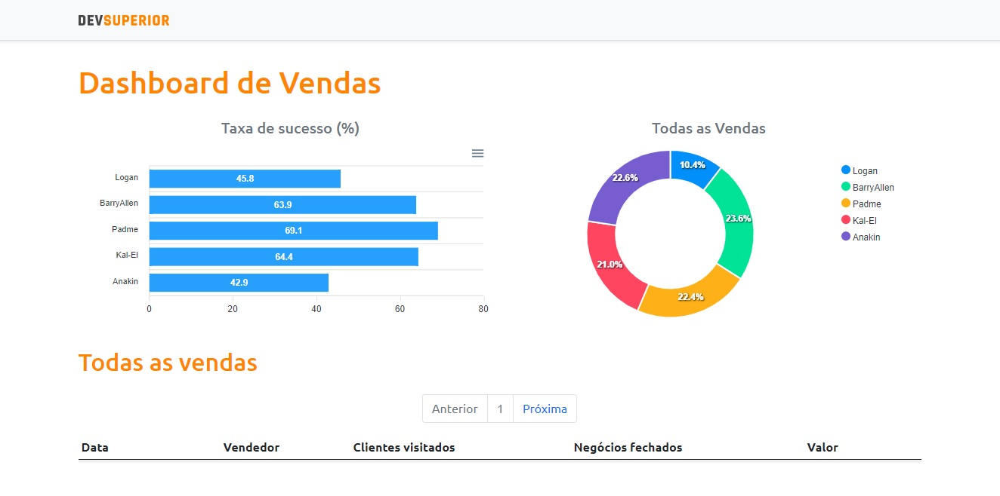

<h1 align="center">
    # Project Graphics
</h1>

<p align="center">
  <a href="#technologies">Technologies</a>&nbsp;&nbsp;&nbsp;|&nbsp;&nbsp;&nbsp;
  <a href="#getting-started">Getting started</a>&nbsp;&nbsp;&nbsp;|&nbsp;&nbsp;&nbsp;
  <a href="#project">Project</a>&nbsp;&nbsp;&nbsp;|&nbsp;&nbsp;&nbsp; 
</p>

<br>

<p align="center">
  
</p>

---

## Technologies

This project was developed using the following technologies:

- [React](https://reactjs.org/)
- [Spring](https://spring.io//)
- [TypeScript](https://www.typescriptlang.org/)

## Getting started

Clone the project and access the folder

```bash
$ git clone https://github.com/HelvioFilho/project-graphics.git && cd project-graphics
```

Follow the steps below
```bash
# Install the dependencies in frontend
$ yarn install
```

## Project

App to show graphs

This is a project developed during the Semana Spring React - SDS 3.0.

<a href="https://project-graphics.netlify.app">https://project-graphics.netlify.app</a>

